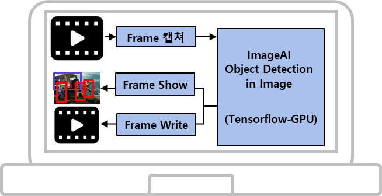
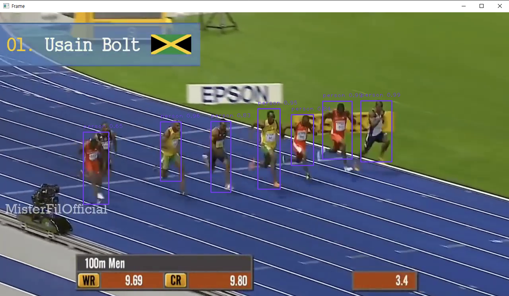
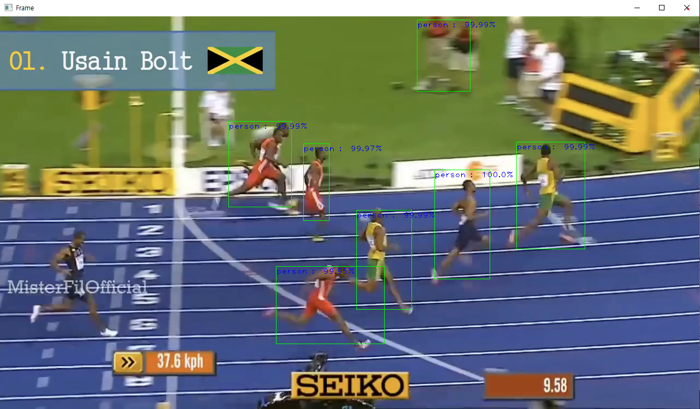
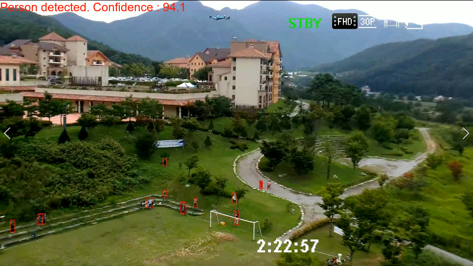
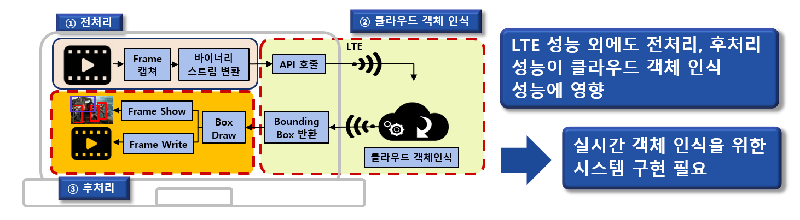
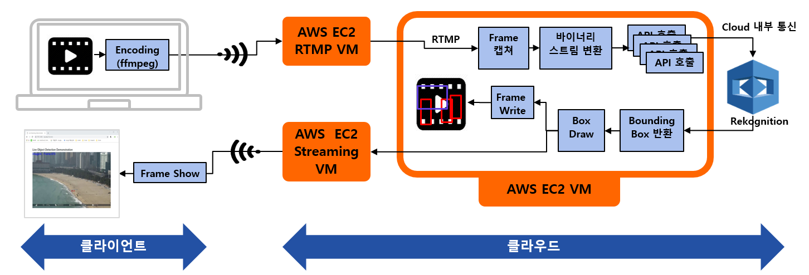
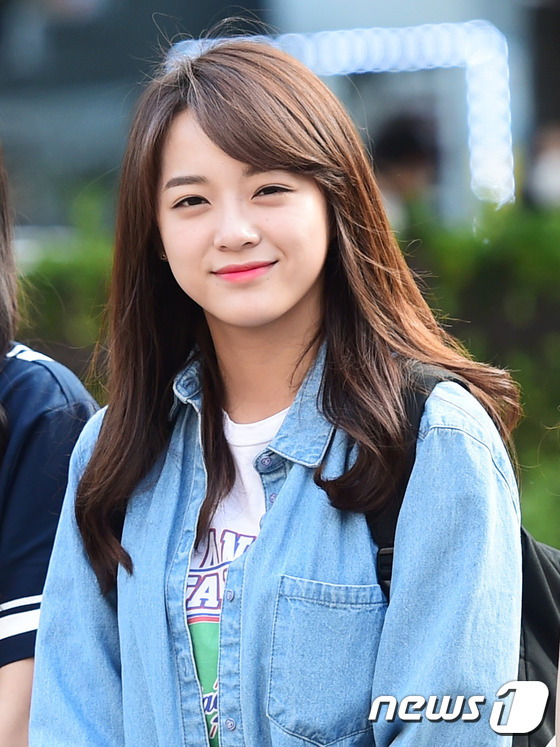
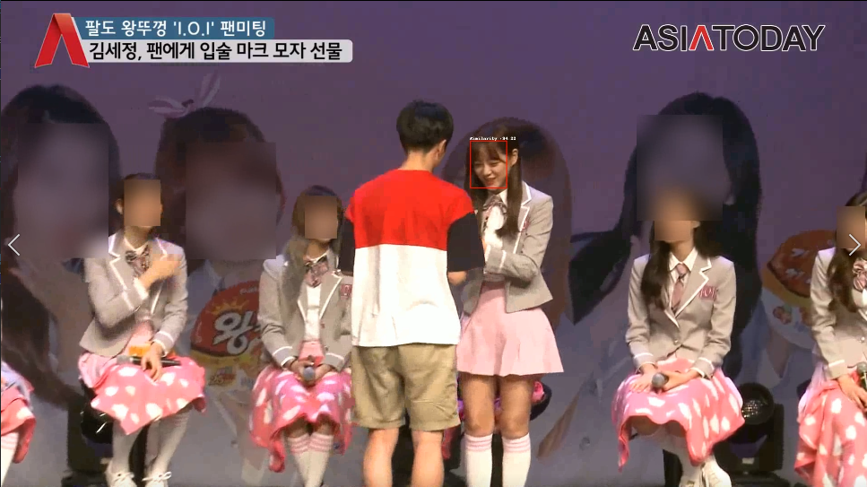
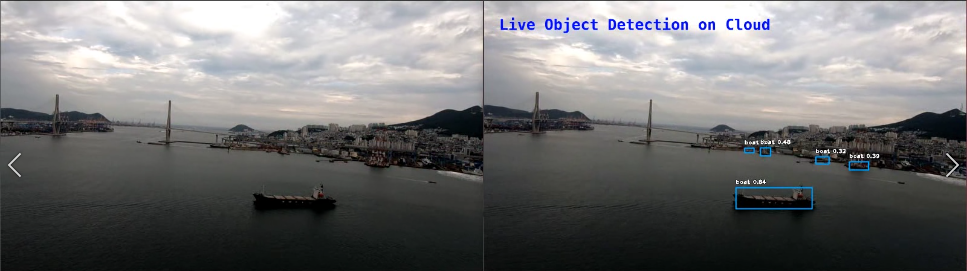

# Live Object Detection Hands-on with ChatGPT

---
# Object Detection in Video
### Detection workflow

<div class="columns">

<div>



</div>


<div>

- OpenCV로 Frame 이미지 캡쳐
- Object Detection Library 호출
- Draw box and write confidence
- Frame OpenCV로 출력
- 감지된 Frame을 동영상으로 변환

</div>

---
# OpenCV Object detection in video

<div class="columns">
<div>

#### [Question](question_for_detect_object.txt) to ChatGPT 
```
python code to detect objects in a video file that 
"detect_objects_in_video.py video.mp4 confidence"

1. read video file name and confidence as parameters
2. read video file and extract each frame as image
3. detect objects in image and draw boxes and 
confidence around detected objects
4. show each rame using  opencv
5. write result video file as videofilename-res.mp4
6. use opencv object detection
```

#### Modify [answer](answer_for_detect_object.txt) code if needed
```
video_out = cv2.VideoWriter(video_file[:-4] + "-res.mp4", 
cv2.VideoWriter_fourcc(*"mp4v"), 30, (frame_width, frame_height))

video_out.write(img)
```

</div>

<div>

#### Run result [code](detect_objects_in_video.py)

```
detect_object_in_video.py video.mp4 0.5
```
[](race-res.mp4)
</div>

---
# ImageAI Object Detection using GPU
<div class="columns">

<div>

### Install [ImageAI](https://imageai.readthedocs.io/en/latest/) for NVidia GPU
- Install **cudatoolkit** in virtual environment for compatibility
- Install pytorch for installed CUDA

```
conda create -n imageaI python=3.9
conda activate imageaI

(imageai) conda install -c conda-forge cudatoolkit
(imageai) pip install torch torchvision 
--index-url https://download.pytorch.org/whl/cu117
(imageai) pip install opencv-contrib-python
(imageai) pip install imageai --upgrade
```
</div>

<div>

### Download [Models](https://imageai.readthedocs.io/en/latest/detection/) and run [code](imageai_detect_object_in_video.py)
```
imageai_detect_object_in_video.py video.mp4 50
```
[](race-imageai.mp4)

</div>

---
# Live Object Detection Applications

<div class="columns">

<div>

### Drone 영상 인식
[](dronevideo_2-Person-70.0.avi)

</div>

<div>

### 개인정보 삭제
[](bangtan-faces-removed.avi)

</div>

---
## Live object detection performance on wireless network

- **Pre-processing** : Video read / Frame Capture / Frame transform to binary
- **Object detection** : Frame transmit / Detection /  frame return
- **Post-processing** : Draw bounding box / Frame show / Video write

---
# Real time ojbect system architecture

- 클라우드의 RTMP 서버로 동영상 전송
- 클라우드의 고성능 GPU에서  전처리, Detection, 후처리 수행
- 스트리밍 서버에서 실시간 영상 전송

---
# Homework

<div class="columns">

<div>

- Face Recognition과 Compare Face를 이용하여 동영상 내에서 특정한 얼굴을 제외한 나머지 사람의 얼굴 blur
 [](ioi-blur-others.avi)

</div>

<div>

- Smartphone 영상 서버로 전송, Object Detection 수행 후 Detection 한 영상을 실시간으로 출력 (Realtime CCTV)

[](Live%20Object%20Detection%20at%20Busan%20Harbor.avi)
</div>